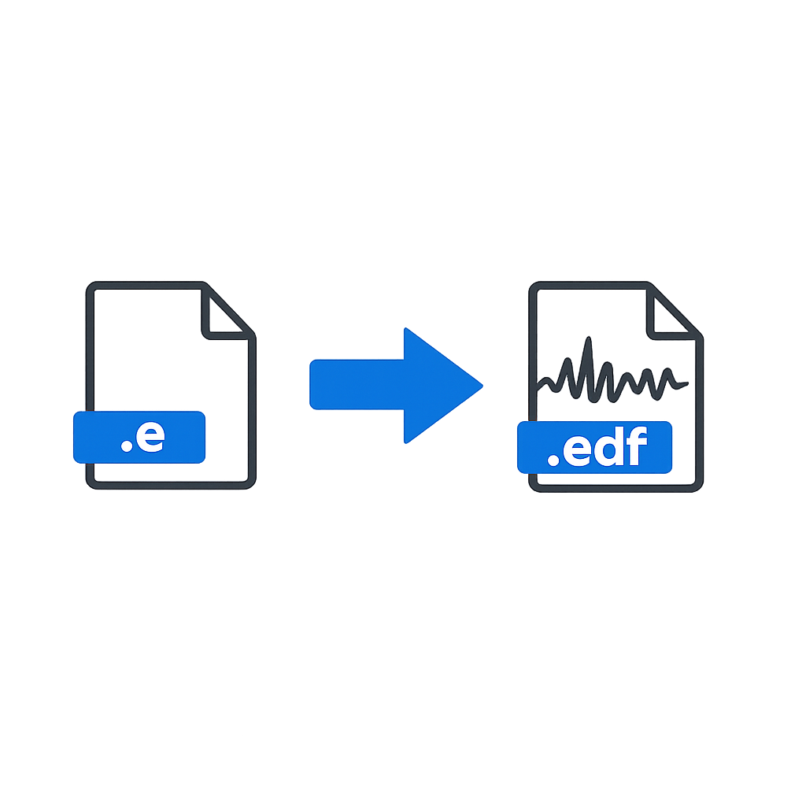
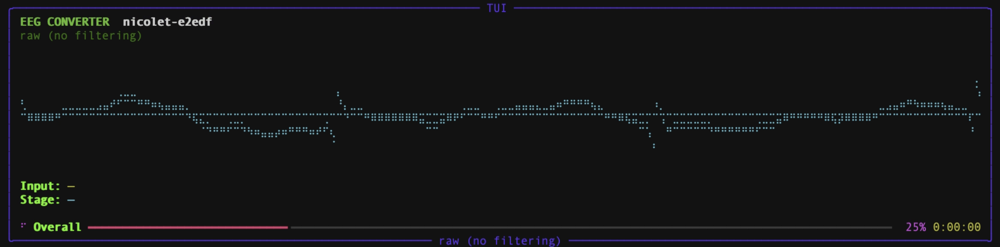

# Nicolet `.e` → EDF



I have not found a native Python way to pry Nicolet/Nervus `.e` files out of their vendor bubble and into something sane like EDF. So this repo is a small collection of scripts that read modern `.e` studies and spit out EDF you can actually feed to MNE, EEGLAB, or whatever analysis rabbit hole you’re in.

No vendor DLLs, no MATLAB runtime, just Python 3.10+ and NumPy. Optional scipy for bandpass/notch filtering.

## Prerequisites

- Python **3.10+**
- Recommended: `uv` (fast, avoids “wrong Python / old pip” issues, and can auto-download a suitable Python)

Install `uv`:

```
# macOS (Homebrew)
brew install uv

# Any OS (pipx)
pipx install uv

# Or (macOS/Linux): curl -LsSf https://astral.sh/uv/install.sh | sh
# Or (Windows PowerShell): irm https://astral.sh/uv/install.ps1 | iex
```

## Quick start

```
# Option A (no hassle): run directly with uv (no local .venv needed)
uv run --isolated --python 3.11 nicolet-e2edf --help
uv run --isolated --python 3.11 nicolet-e2edf --in /path/to/case.e --out ./edf_drop

# Option B: create a project venv with uv
uv venv --python 3.11 .venv
uv pip install -p .venv -e .
# For dev tooling (pytest/ruff/black/etc): uv pip install -p .venv -e '.[dev]'   # quote for zsh
source .venv/bin/activate             # or .\\.venv\\Scripts\\Activate.ps1 on Windows

# Option C: plain venv + pip (requires Python ≥3.10; upgrade pip if editable install fails)
# python3.11 -m venv .venv
# source .venv/bin/activate
# python -m pip install -U pip setuptools wheel
# python -m pip install -e .
# For dev tooling: python -m pip install -e '.[dev]'   # quote for zsh
```

With the venv activated (Option B/C), you now have a `nicolet-e2edf` CLI on your PATH:

```
# Batch/automation mode (pure CLI)
nicolet-e2edf --in /path/to/case.e --out ./edf_drop
nicolet-e2edf --in ./eeg_files --out ./edf_drop --glob '**/*.e'

# You can also pass multiple files directly (useful with shell globs):
nicolet-e2edf --in EEG_test_files/eeg_files/**/*.e --out ./edf_drop
```

### Interactive UI mode

Launch the wizard-style terminal UI (menus/prompts + animated progress):



```
uv run --isolated --python 3.11 --with rich nicolet-e2edf --ui

# Or, in a venv:
uv pip install -p .venv '.[tui]'
nicolet-e2edf --ui
```

When converting a folder, the converter always looks for both `.e` and `.eeg` files. Use `--glob` to narrow by name/path (e.g. `Patient1_*`), not to switch file types.

When converting a folder, the converter mirrors the input folder structure under the output directory to avoid overwriting files that share the same base name.

### Troubleshooting

- zsh says `no matches found: .[dev]`: quote it: `'.[dev]'` (or escape the brackets).
- `pip install -e ...` fails with “editable mode requires setuptools”: upgrade pip: `python -m pip install -U pip setuptools wheel` or use `uv pip`.

### CLI options at a glance

* `--glob`: alternative discovery pattern when the input path is a directory (default adds `.eeg`).
* `--patient-json`: optional path to a JSON file with per-glob metadata overrides. Each object needs a `"glob"` key plus the EDF patient fields to override, e.g. `[{"glob": "Patient*.e", "PatientName": "Anon Subject"}]`.
* `--json-sidecar`: emit a `<case>.json` alongside the EDF with channel labels, sample count, sampling rate, start time (when present), and events.
* `--resample-to`: resample the output to a single sampling rate before writing.
* `--lowcut`: optional high-pass filter cutoff in Hz (e.g. `--lowcut 0.5`). Requires scipy.
* `--highcut`: optional low-pass filter cutoff in Hz (e.g. `--highcut 35`). Requires scipy.
* `--notch`: optional notch filter in Hz to remove powerline interference (e.g. `--notch 50` or `--notch 60`). Requires scipy.
* `--verbose`: surface converter logging.
* `--ui`: launch the interactive terminal wizard (requires `rich`).

**Filter examples:**

```bash
# Clinical defaults: 0.5–35 Hz bandpass + 50 Hz notch
nicolet-e2edf --in ./data --out ./edf_drop --lowcut 0.5 --highcut 35 --notch 50

# US powerline: 60 Hz notch only
nicolet-e2edf --in ./data --out ./edf_drop --notch 60

# High-pass only (remove DC drift)
nicolet-e2edf --in ./data --out ./edf_drop --lowcut 0.1

# No filtering (default behavior, preserves raw signal)
nicolet-e2edf --in ./data --out ./edf_drop
```

If filtering is requested, install scipy:

```bash
uv pip install -p .venv scipy
# or install the optional dependency group:
uv pip install -p .venv -e '.[filter]'
```

## Looking at the result

Once you have an EDF, point the bundled MNE helper at it:

```
# Install MNE into the same environment (pick one):
uv pip install -p .venv mne
# or: python -m pip install mne

.venv/bin/python inspect_edf.py edf_drop/Patient1.edf
.venv/bin/python inspect_edf.py edf_drop/Patient1.edf --notch 60
.venv/bin/python inspect_edf.py edf_drop/Patient1.edf --lowcut 1 --highcut 40 --notch 50
```

By default you'll get a 0.5–35 Hz bandpass, 50 Hz notch, double-banana montage, 12-second window, and 100 µV/cm scaling—basically what the neurologist on call expects. Adjust `--lowcut` and `--highcut` to change the filter bounds (set to 0 to disable). On a headless box, pass `--snapshot out.png` and it will quietly save the figure instead of trying (and failing) to pop a window.

## What's actually in here

Inside `nicolet_e2edf/nicolet/`:

- `header.py` – the clean-room reinterpretation of FieldTrip's header reader, mapping GUIDs, segments, events.
- `data.py` – sequential waveform reader that hands you µV traces for chosen channels/ranges.
- `edf_writer.py` – minimal EDF+ writer, nothing fancy, just correct scaling and timestamps.
- `cli.py` – the `nicolet-e2edf` entry point with batch support, filtering, resampling, and metadata rules.
- `tui.py` – the interactive terminal wizard and animated progress UI.

At the repo root:

- `inspect_edf.py` – MNE-based EDF viewer with double-banana montage and configurable filters.
- `nicolet_e2edf/tools/view_with_mne.py` – quick peek straight from `.e` without converting.
- `nicolet_e2edf/tests/` – unit + end-to-end tests with synthetic headers/data so CI doesn't need real PHI.

Limitations to keep in mind while hacking: mixed sampling rates inside a single conversion are dropped (only the dominant rate is kept) and the EDF writer currently sticks to EDF+ annotations for events.

## Attribution

This converter contains logic adapted from the FieldTrip toolbox (GPL-3.0), in particular `read_nervus_data.m` and `read_nervus_header.m` from the FieldTrip project: https://github.com/fieldtrip/fieldtrip.

## Licence

Released under the GPL-3.0 license; see `LICENSE` for full terms. If you redistribute wheels or docker images, ship the licence and attribution with them—future-you (and the FieldTrip authors) will thank you.
