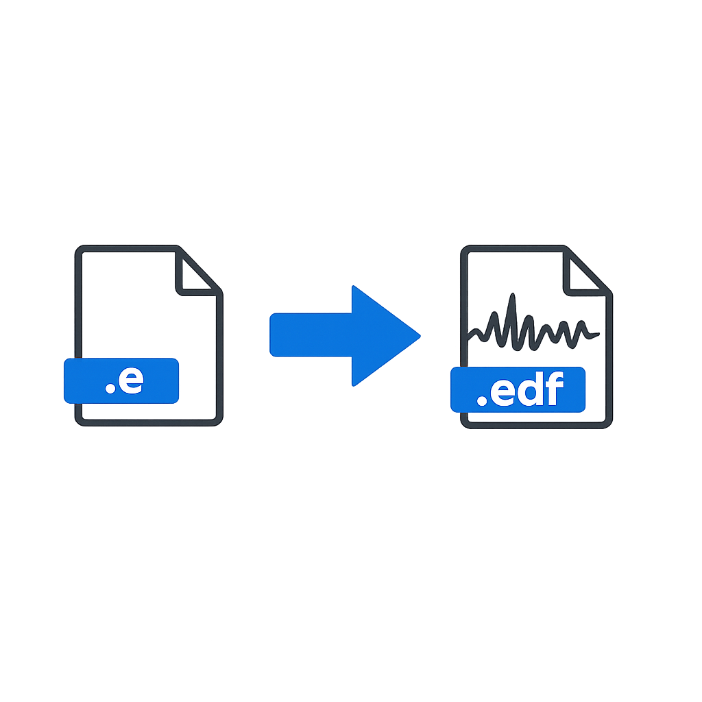
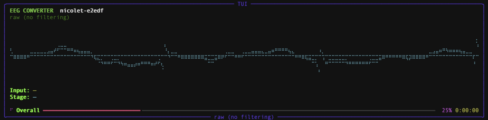

# Nicolet `.e`/`.eeg` → EDF



A Python tool to convert Nicolet/Nervus `.e` EEG files into standard EDF+ format. No vendor DLLs, no MATLAB (which costs money!), just Python! I couldn't find a native Python way to get `.e` files out of their vendor format, so me and Opus 4.5 wrote this.

> **Acknowledgment**: This project wouldn't exist without the excellent [FieldTrip](https://github.com/fieldtrip/fieldtrip) toolbox. Their MATLAB implementation of the Nervus/Nicolet file format (`read_nervus_header.m` and `read_nervus_data.m`) was the foundation for this Python port. Since then, we've added substantial GUID/event and channel ID parsing logic through our own reverse‑engineering work. Thank you to the FieldTrip team!

> **Note**: Some of our reverse‑engineered event labels are (unfortunately) in Norwegian.

## Quick Start

Clone the repository (or download it as a ZIP) from GitHub:

```bash
git clone https://github.com/haukurtg/e2edfconverter.git
cd e2edfconverter
```

The easiest way — no manual environment/dependency setup needed (`uv` handles it for you):

```bash
# Install uv if you don't have it (https://docs.astral.sh/uv/)
brew install uv  # or: curl -LsSf https://astral.sh/uv/install.sh | sh

# Convert a single file
uv run --isolated nicolet-e2edf --in /path/to/recording.e --out ./edf_output

# Convert a folder of .e/.eeg files
uv run --isolated nicolet-e2edf --in ./my_eeg_folder --out ./edf_output
```

If you want a local environment for repeated use/development:

```bash
uv sync
uv run nicolet-e2edf --help
```

### Optional faster reads (0.4.0)

Conversion got faster in 0.4.0 without changing the output bytes. There is also
an experimental reader that merges adjacent disk reads into bigger ones (capped
at 8 MiB per read). It produces identical output but is off by default for now;
turn it on if you want the extra speed:

```bash
NICOLET_E2EDF_COALESCE_READS=1 uv run --isolated nicolet-e2edf \
    --in /path/to/recording.e --out ./edf_output
```

or from Python: `read_nervus_data(path, header, coalesce_reads=True)`.

### Interactive Mode

For a guided experience with menus and progress bars:

```bash
uv run --isolated --with rich nicolet-e2edf --ui
```



## CLI Options

| Option | Description |
|--------|-------------|
| `--in` | Input `.e`/`.eeg` file or folder |
| `--out` | Output directory for EDF files |
| `--glob` | Filter pattern when input is a folder (e.g. `recording_*`) |
| `--json-sidecar` | Also emit a `.json` with metadata (channels, events, etc.) |
| `--split-by-segment` | Output one EDF per segment if the recording contains multiple segments |
| `--vendor-style` | Suppress system events to better match vendor EDF exports |
| `--resample-to` | Resample to a specific rate (Hz) (requires scipy) |
| `--lowcut` | High-pass filter cutoff in Hz (requires scipy) |
| `--highcut` | Low-pass filter cutoff in Hz (requires scipy) |
| `--notch` | Notch filter for powerline noise, e.g. `50` or `60` Hz (requires scipy) |
| `--ui` | Launch interactive terminal UI (requires rich) |
| `--verbose` | Show detailed logging |

**Filtering example:**

```bash
# Clinical defaults: 0.5–35 Hz bandpass + 50 Hz notch
uv run --isolated --with scipy nicolet-e2edf \
    --in ./data --out ./edf_output \
    --lowcut 0.5 --highcut 35 --notch 50
```

**Vendor-style comparison example:**

```bash
# Match vendor-style exports (split per segment + suppress system events)
uv run --isolated nicolet-e2edf \
    --in /path/to/recording.e --out ./edf_output \
    --split-by-segment --vendor-style --json-sidecar
```

## Viewing the Results

There's a bundled viewer script that shows your EDF in a double-banana montage:

```bash
uv run --isolated --with mne python inspect_edf.py ./edf_output/recording.edf
```

**Note:** When using the interactive TUI (`--ui`), the viewer is automatically launched with MNE in an isolated environment if needed. No manual installation required!

Options: `--lowcut`, `--highcut`, `--notch`, `--snapshot out.png` (for headless systems).

Filtering during conversion (`--lowcut`, `--highcut`, `--notch`) is lossy. In most cases, keep exports unfiltered and only use conversion-time filtering when you intentionally want a preprocessed output for direct downstream use (for example, an ML pipeline).

## Limitations

- Mixed sampling rates: default exports only dominant-rate channels; use `--resample-to` to include all "on" channels.
- When `--resample-to` is used, channels are resampled to the requested integer EDF rate.
- Events are written as EDF+ annotations
- EVENTTYPEINFOGUID labels are reverse-engineered; unknown GUIDs may be exported as UNKNOWN.
- `.eeg` support is currently not reliable; we need a larger `.eeg` dataset to implement and validate it properly.
- Some `.e` recordings store only numeric channel IDs (e.g., `1..64`). The numeric-channel fix and montage-recovery strategy (from `v0.2.5`) are mainly aimed at recovering channel names in atypical multi-channel EEG setups (`32`, `64`, `128`, etc.) using source montage derivations, fixed DERIVATION tables, and hidden montage catalogs.
- The CLI supports folder input, but processes files serially. For large cohorts, it is usually more efficient to call the CLI from a small batch wrapper that runs multiple workers and tracks progress/errors.

## Contributing

Contributions are welcome! If you're working on the EDF writer or want to understand the file format:

- **EDF+ Specification**: A copy of the full EDF+ specification is included at [`docs/EDF+ specification.pdf`](docs/EDF+%20specification.pdf). The official spec is also available at [edfplus.info](https://www.edfplus.info/specs/edfplus.html).
- **Tests**: Run `uv run pytest` to verify EDF+ compliance. We use PyEDFlib as a strict validator.

## Profiling And Regression Checks

Two helper scripts are included for speed work that must not change output:

- `tools/profile_conversion_stages.py`
  - Runs an in-process conversion profile for one or more `.e` files.
  - Breaks runtime into rough stages such as header read, waveform read, EDF write, and JSON write.
- `tools/validate_regression_equivalence.py`
  - Re-converts a regression corpus and compares the result against a known-good baseline.
  - Checks EDF byte equality plus exact equality of sidecar `channels`, `events`, and `annotations` (ignoring only the expected `edf_file` output path field).

Recommended workflow for performance changes:

1. Profile on a small representative local corpus.
2. Make the optimization.
3. Run `uv run pytest`.
4. Run the regression-equivalence validator before merging.


## License

GPL-3.0 — see `LICENSE`.

This project adapts logic from the [FieldTrip](https://github.com/fieldtrip/fieldtrip) toolbox (GPL-3.0).
